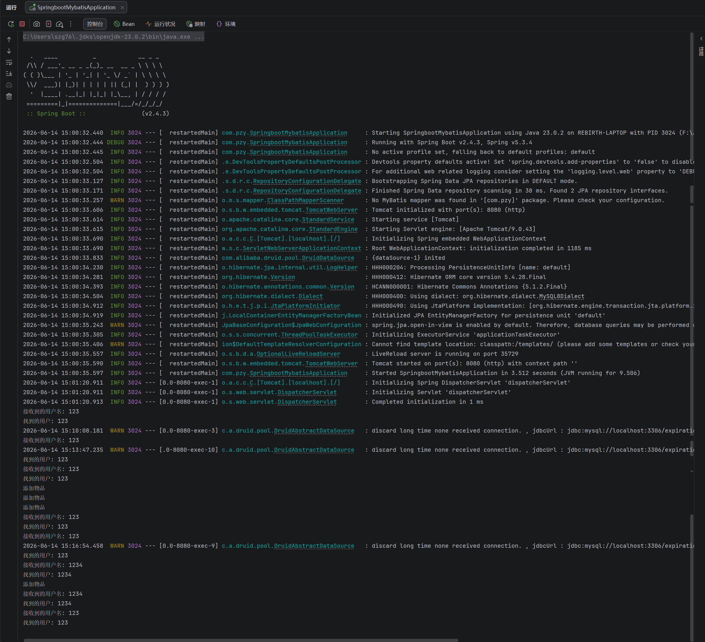

# 保质期管理系统 - 后端服务 (Expiration Management System - Backend)

本项目为物品保质期管理系统的后端核心服务。基于主流的 Java 技术栈搭建，采用分层架构设计，为前端（如微信小程序、Web 端）提供标准化、去耦合的 RESTful API 接口，实现用户身份鉴权与物品保质期的全生命周期管理。

### 一、技术栈

* **核心框架：** Spring Boot (负责业务逻辑解耦与依赖注入)
* **持久层框架：** MyBatis (数据访问与对象关系映射)
* **数据库连接池：** Alibaba Druid (提供高性能的数据源连接与监控)
* **数据库：** MySQL 8.0 (实体数据关系持久化)
* **日志管理：** SLF4J 和 Logback (规范化的生产级日志审计)

### 二、项目结构

```text
src/main
├── java
│   └── com.pzy （项目根业务包，所有 Java 代码的统一包路径）
│       ├── SpringbootMybatisApplication.java  # Spring Boot 项目启动主类：整个程序的运行入口，负责启动 Spring 容器、自动加载项目配置、扫描并注册所有业务组件
│       ├── controller （控制层包）
│       │   ├── ProductController.java          # 产品接口控制器：接收前端关于产品的 HTTP 请求，做基础参数校验，调用业务层处理逻辑后返回响应结果，包含产品新增、删除、按用户/类型查询等接口
│       │   └── UserController.java             # 用户接口控制器：接收前端关于用户的 HTTP 请求，处理登录、注册的请求逻辑，调用业务层完成用户身份校验与账号注册
│       ├── entity （实体层包）
│       │   ├── Product.java                    # 产品实体类：和数据库产品表做 ORM 映射的 Java 类，封装产品的 id、名称、类型、保质期、所属用户ID 等核心属性
│       │   └── User.java                       # 用户实体类：和数据库用户表做 ORM 映射的 Java 类，封装用户的 id、用户名、密码等核心属性
│       ├── repository （数据访问层包）
│       │   ├── ProductRepository.java          # 产品数据访问接口：继承 Spring Data JPA 的 JpaRepository，直接对接数据库，提供产品的基础增删改查能力，以及自定义条件查询方法
│       │   └── UserRepository.java             # 用户数据访问接口：继承 Spring Data JPA 的 JpaRepository，提供用户的基础增删改查能力，以及按用户名查询用户的自定义方法
│       └── service （业务逻辑层包）
│           ├── ProductService.java             # 产品业务类：编写产品相关的具体业务逻辑，调用 Repository 层完成数据库操作，为 Controller 层提供业务能力
│           └── UserService.java                # 用户业务类：编写用户查询、注册的具体业务逻辑，调用 Repository 层完成数据库操作，为 Controller 层提供业务能力
└── resources （项目资源目录）
    └── application.yml                          # 项目全局配置文件：集中配置服务器端口、数据库连接信息、日志输出规则、框架运行参数等所有项目配置项

```

### 三、核心 API 接口设计

所有接口均已配置全局跨域支持，完美适配小程序本地调试环境。

#### 1. 用户管理模块 (路由前缀：/user)

* **特征：** 处理用户账户的生命周期与身份校验。
* **接口一：** 请求方法为 `POST`，路由地址为 `/user/register`，功能描述为新用户注册认证，请求体/参数为 JSON 格式的 `username` 和 `password`，返回状态码为 `211 Created` 或者 `409 Conflict`。
* **接口二：** 请求方法为 `POST`，路由地址为 `/user/login`，功能描述为用户登录状态鉴权，请求体/参数为 JSON 格式的 `username` 和 `password`，返回状态码为 `200 OK` 或者 `401 Unauthorized`。

#### 2. 物品保质期管理模块 (路由前缀：/product)

* **特征：** 实现对具体物品的时效性监控与数据维护。
* **接口一：** 请求方法为 `GET`，路由地址为 `/product/getProductsByUserId/{userId}`，功能描述为获取指定用户的所有物品列表，路径参数为 `userId`，返回状态码为 `200 OK` 或者 `404 Not Found`。
* **接口二：** 请求方法为 `POST`，路由地址为 `/product/add`，功能描述为新增保质期追踪物品，请求体/参数为 `Product` 实体数据，返回状态码为 `211 Created` 或者 `400 Bad Request`。
* **接口三：** 请求方法为 `DELETE`，路由地址为 `/product/delete/{id}`，功能描述为根据主键 ID 逻辑/物理删除物品，路径参数为 `id`，返回状态码为 `200 OK` 或者 `404 Not Found`。
* **接口四：** 请求方法为 `GET`，路由地址为 `/product/getProductsByUserIdAndType`，功能描述为根据分类筛选用户的到期物品，查询参数为 `userId` 和 `productType`。返回状态码为 `200 OK` 或者 `400 Bad Request`。

### 四、数据库环境初始化

本项目数据库架构名称定为 `expiration`。本地开发调试前，请务必先导入仓库中附带的数据库初始化脚本：

1. 确保本地 MySQL 服务已启动。
2. 创建目标数据库，在终端或可视化工具中执行命令：
```sql
CREATE DATABASE expiration CHARACTER SET utf8mb4 COLLATE utf8mb4_general_ci;

```


3. 运行仓库根目录下的 `MySQL.sql` 脚本以初始化用户表 (`user`) 和物品表 (`product`)。

### 五、本地部署指引

1. **修改环境配置：**
打开 `src/main/resources/application.yml`，根据本地实际情况修改数据库连接凭证：
* `spring.datasource.username` 填入你的数据库用户名，默认通常是 `root`
* `spring.datasource.password` 填入你的数据库密码
* `spring.datasource.url` 填入数据源连接地址，即 `jdbc:mysql://localhost:3306/expiration`


2. **编译并运行：**
在 IntelliJ IDEA 中等待 Maven 或 Gradle 依赖解析同步完毕后，直接运行 `SpringbootMybatisApplication.java` 主类。后端服务将默认在 `8080` 端口拉起。
3. **前端对接注意：**
若在微信开发者工具中进行本地回调调试，请确保在工具的 `本地设置` 中勾选 **“不校验合法域名、web-view（业务域名）、TLS版本以及HTTPS证书”**，并将请求基地址指向 `http://localhost:8080` 即可。

### 六、 项目运行截图


